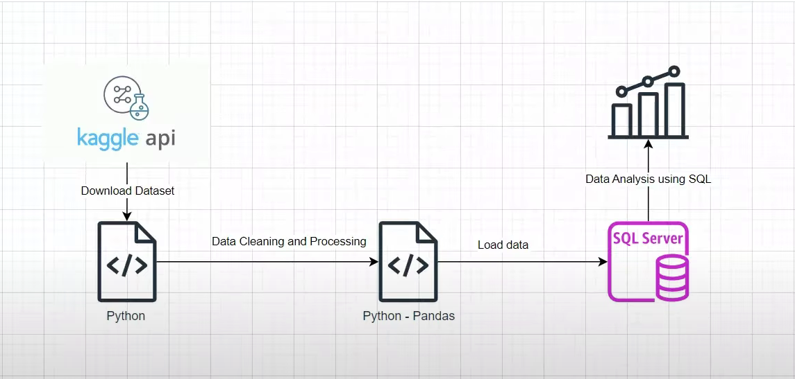

# Retail Orders Documentation

This document serves as the complete technical documentation for the Retail Orders ETL project. It includes:

1. **ETL Process Design**
   - Data extraction from Kaggle using CLI and API authentication.
   - Data transformation using pandas: column normalization, missing value handling, new feature creation.
   - Data loading into MySQL using SQLAlchemy.

2. **System Requirements and Setup Instructions**
   - Python version, libraries, and environment setup.
   - MySQL server configuration.
   - Kaggle API setup for secure dataset access.

3. **Execution Guide**
   - How to run the script, expected outputs, and logics behind data modifications.

4. **SQL Query Catalog**
   - A list of business-relevant SQL queries used to derive insights from the data, with notes on what each query achieves.

5. **Best Practices**
   - Use of parameterized DB connections.
   - Handling repeated execution behavior (e.g., `if_exists='append'` in `to_sql`).

## License

This project is for educational and development purposes only.


## Section 1: Creation of ETL Pipeline for `retail_orders` Dataset

# Retail Orders ETL Script

This Python script performs a complete ETL (Extract, Transform, Load) process using a retail orders dataset from Kaggle. The script downloads the dataset, processes it by cleaning and transforming the data, and loads it into a MySQL database.

## Overview

- Downloads the dataset using the Kaggle CLI.
- Cleans and transforms the data using pandas.
- Calculates financial metrics such as discount, sale price, and profit.
- Loads the processed data into a MySQL database.
- Performs data analysis using SQL queries on the loaded dataset.

## Project Flow Diagram

Below is the architecture diagram of the ETL pipeline:



### Description:
- **Kaggle API**: Used to download the dataset programmatically.
- **Python Script**: Handles dataset download, cleaning, transformation, and metric calculation.
- **Pandas**: Used for in-memory data cleaning and processing.
- **SQL Server**: Stores the cleaned dataset for analysis.
- **SQL Queries**: Used to derive analytical insights and perform business intelligence tasks.

## Requirements

- Python 3.7+
- MySQL Server (running locally or accessible remotely)
- Required Python packages:
  - pandas
  - sqlalchemy
  - mysql-connector-python
  - kaggle
  - python-dotenv==1.0.1

You can install the required packages using:

```bash
pip install -r requirements.txt
```

## Kaggle API Setup

1. Go to your Kaggle account settings and generate an API token.
2. Place the downloaded `kaggle.json` file in the directory `~/.kaggle/`.
3. Ensure the following permissions:
   - The file should be readable only by the user: `chmod 600 ~/.kaggle/kaggle.json`.

Alternatively, you can set the credentials via environment variables:

```bash
export KAGGLE_USERNAME=your_username
export KAGGLE_KEY=your_key
```

## MySQL Configuration

Ensure your MySQL server is running. Update the connection credentials in the script to match your setup:

```python
user="root",
password="*****",
host="localhost",
port=3306
```

The script creates a database named `retail_orders` if it does not already exist and inserts data into a table named `df_orders`.

## How to Use This Pipeline

Follow these steps to execute the ETL pipeline:

1. **Set up the virtual environment:**
   ```bash
   python -m venv venv
   source venv/Scripts/activate  # For Windows Git Bash
   pip install -r requirements.txt
   ```

2. **Configure environment variables:**
   Create a `.env` file in the root directory with your MySQL credentials and target table:
   ```env
   MYSQL_USER=root
   MYSQL_PASSWORD=password
   MYSQL_HOST=localhost
   MYSQL_DB=retail_orders
   MYSQL_TABLE=df_orders
   ```

3. **Run the pipeline:**
   ```bash
   python main.py
   ```
   This downloads the dataset, cleans it, and loads it into your MySQL database.

4. **Verify the results:**
   Check your MySQL server for the `retail_orders` database and confirm that the `df_orders` table is populated.

## Running the Script

Run the script from your terminal:

```bash
python etl_retail_order.py
```

The script performs the following steps:

1. Downloads and unzips the dataset from Kaggle.
2. Loads the data into a pandas DataFrame.
3. Renames columns, cleans missing values, and derives new columns.
4. Drops unnecessary columns.
5. Connects to MySQL and creates the database (if needed).
6. Inserts the cleaned data into the `df_orders` table.

## Output

- MySQL Database: `retail_orders`
- Table: `df_orders`
- Columns: cleaned and transformed retail order data

## SQL Queries Executed on `df_orders`

The following SQL queries were used to analyze and extract insights from the `df_orders` table:

### 0. Top 10 Highest Revenue Generating Products
- Aggregated total revenue per product and selected the top 10 products with the highest revenue.

### 1. Month-over-Month (MoM) Sales Comparison for FY 2022 vs FY 2023
- Compared monthly sales revenue for each month between FY 2022 and FY 2023.
- Included YoY percentage change and trend indicators.

### 2. Top 5 Products per Region by Revenue
- Used `ROW_NUMBER()` with `PARTITION BY region` to rank products based on total revenue.

### 3. MoM Revenue Growth Query Optimization
- Created a pivoted version of monthly revenue using `CASE` and `MAX()` to display FY 2022 and 2023 side-by-side.

### 4. Highest Sales Month per Category
- Identified the month with the highest sales for each product category using `ROW_NUMBER()`.

These queries provided key insights into seasonal trends, regional performance, and product-wise revenue contribution.

## Notes

- Repeated script execution will append data to the existing table. Modify the `if_exists` parameter in `to_sql()` if needed.
- Make sure the dataset and column names match the script's expectations if using a different source.

# Business Insights and Recommendations

## Business Insights

1. Revenue and Profit Overview

Total Revenue: $11,079,328

Total Profit: $1,039,928

Profit Margin: Approximately 9.4%. This suggests a modest margin, indicating room for optimization either through pricing strategies, cost control, or improving sales of higher-margin products.

2. Regional Revenue Contribution

West: $3.47M

East: $3.26M

Central: $2.39M. The West region leads in revenue generation. Region-wise performance implies that strategic investments in high-performing regions could yield better returns, while the underperformance of certain regions (e.g., South) may need root-cause analysis.

3. Revenue by Product Category

Technology: $3.93M

Furniture: $3.72M

Office Supplies: $3.42M. Technology contributes the highest revenue, likely due to higher unit prices. A focused strategy on this category can further strengthen overall financial performance.

4. Top Revenue-Generating Subcategories

Chairs: $1.60M

Phones: $1.57M

Tables: $1.10M. These subcategories are key drivers of revenue. Identifying what makes them successful (e.g., price, demand, promotions) could provide a blueprint for other subcategories.

5. Month-over-Month Sales Trends (FY 2022–2023)

Month-wise comparisons indicate seasonal trends. Some months consistently outperform others, reflecting periodic surges in consumer demand. These insights can be used for forecasting and marketing alignment.

6. Region-wise Product Preferences

Analysis of top products in each region shows that product preferences are not uniform. This suggests opportunities for region-specific assortment planning, targeted marketing, and optimized inventory distribution.

7. Highest Growth Subcategories

The highest-growing subcategories signal emerging customer interests. If supported with marketing and availability, these can become significant revenue contributors in the near future.

8. Most Profitable Months

Identifying peak profitability months helps in planning promotions, managing stock, and preparing logistics well in advance. It also supports budgeting and forecasting efforts.

## Recommendations

1. Optimize Product Strategy

Prioritize inventory and marketing for subcategories like Chairs, Phones, and Tables.
Focus on products with both high revenue and high margins to improve overall profitability.

2. Regional Strategy Enhancement

Implement region-specific promotions and stock strategies based on top-performing products in each area.
Investigate and address underperformance in regions like the South to identify operational or market-fit issues.

3. Leverage Seasonality

Use insights from month-over-month trends and profitable months to schedule campaigns and adjust pricing strategies.
Align procurement and logistics to ensure availability during peak demand periods.

4. Invest in High-Growth Subcategories

Monitor emerging subcategories showing high YoY growth.
Pilot targeted campaigns or bundle offers to further test and scale growth in these areas.

5. Rationalize Low-Performing Segments

Identify underperforming products with low revenue or negative margins.
Re-evaluate these SKUs for repositioning, discounting, or possible discontinuation.
